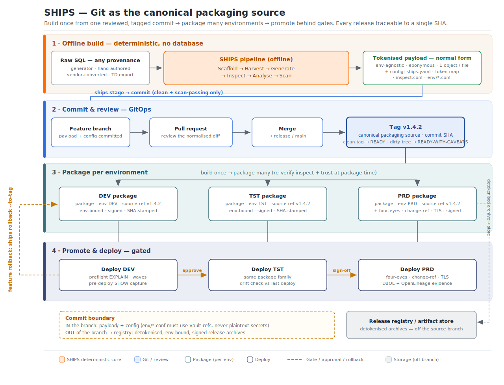
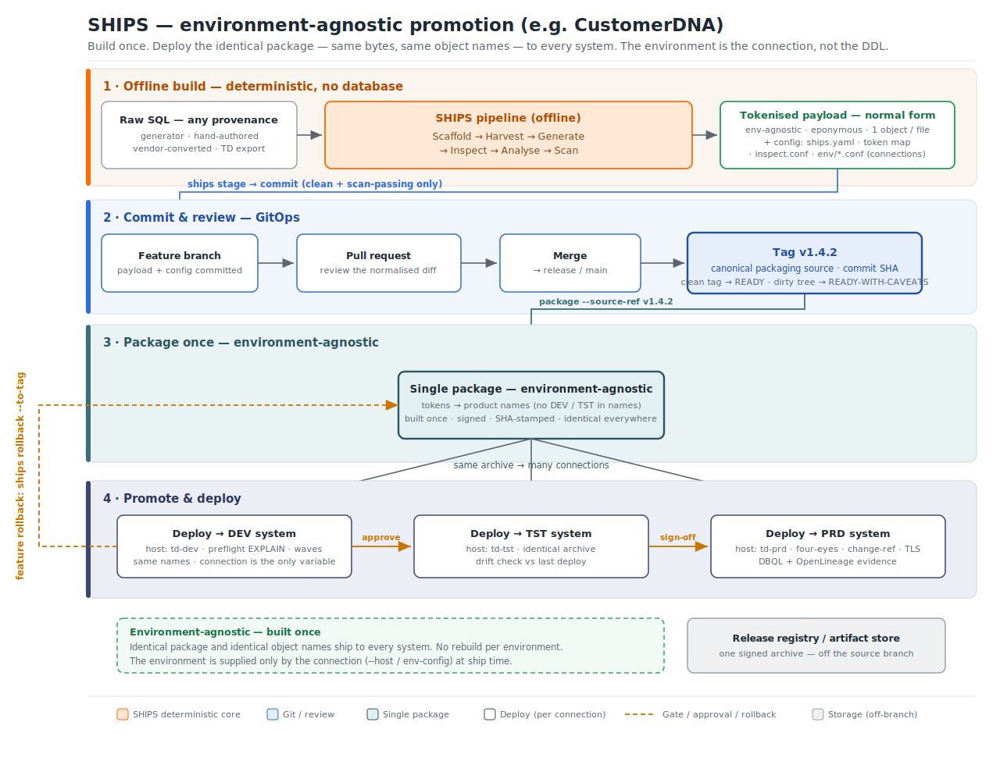

# ADR-0016 — Git as the canonical packaging source

> **Status:** Proposed
> **Date:** 2026-06-30
> **Deciders:** Paul Dancer (Worldwide Field Technology Architect) and SHIPS co-architects
> **Supersedes / relates to:** ADR-0008 (ON-object DCL grouping), ADR-0011 (package integrity & forged-hash mitigation)

---

## Context and problem statement

Once SHIPS has scaffolded, harvested, generated, inspected, analysed and scanned a source tree, it holds a **tokenised payload** — the deterministic normal form of the input: environment-agnostic, one object per file, eponymous, with the object type carried in the file extension. This payload is the artefact the rest of the pipeline treats as authoritative.

The question this ADR settles is: *where does that payload live between build and package, and what does packaging consume?* In practice teams have been ambiguous about whether the payload is a throwaway working directory or a durable, versioned artefact. That ambiguity undermines provenance (what exactly was packaged?), review (what changed?), and handoff (how does another actor — human or agent — continue the work?).

SHIPS is already built on the implicit assumption that a committed source of truth exists: the package builder stamps a resolved commit SHA into `context/ships.build.json`, there is a `source_dirty` flag, packaging accepts `--source-github <org/repo> --source-ref <ref>`, and feature rollback (`ships rollback --to-tag`) only functions because it can rebuild from tagged source. This ADR makes that assumption explicit and defines the conventions around it.

## Decision drivers

- **Provenance** — every release must trace to an exact, reviewable state.
- **Reviewability** — changes should be reviewable as a clean diff, by a human or an agent.
- **Determinism** — committing is only sound if the same inputs always produce the same payload. Harvest determinism is an established invariant, which makes the payload a stable thing to version.
- **Portability** — the committed artefact must remain environment-agnostic so it can be packaged for many targets.
- **Auditability and handoff** — the durable substrate that lets one actor (or a different agent) pick up the work without shared memory.
- **Security** — no plaintext secrets may enter version control.

## Decision

**Commit the tokenised payload (plus project configuration) to Git, review it by pull request, tag the reviewed commit, and package every environment from that tag. The detokenised release archive is a build output and is never committed to the source branch.**

The tokenised payload is canonical *source*, not a build output. Because harvest is deterministic, committing it versions a stable, reproducible artefact. A pull-request diff over the normalised payload is a *better* review surface than raw heterogeneous SQL, because every file is a single object in a consistent shape — a reviewer, or an agent, sees precisely what changed.

### The commit boundary

| In the branch (canonical source) | Out of the branch (build output → registry) |
|---|---|
| `payload/` — the tokenised, eponymous payload | The detokenised release archive (`PRD_<name>_BUILD_*.zip`) |
| `ships.yaml`, `config/inspect.conf`, the token map | Environment-bound, signed, not portable |
| `config/env/*.conf` — **only** where token values use Vault references (`vault:…`), never plaintext secrets | Published to a release registry / artifact store, or to Git *releases/tags*, each referencing its source commit |

If an environment config carries plaintext credentials it **must not** be committed; convert its secret-bearing values to Vault references first.

`ships.decisions.json` is **out of scope** for the source branch — it is an append-only run/audit log that churns and would create merge noise, and it is kept on a separate audit path rather than committed. Staging is performed by the **`ships stage`** verb, which stages exactly the in-branch set above (payload + config) as a single safe gate — never the detokenised archive and never `ships.decisions.json`. This gives an agent one bounded action in place of ad-hoc `git add`.

### The promotion model

One reviewed, tagged commit fans out to N environment packages and N deploys, each traceable to a single SHA:

1. **Feature branch** — harvest, generate, inspect, analyse, fix violations, then `scan --all-envs` to confirm no token is undefined for any target. Stage the canonical source set with `ships stage` (it stages exactly the payload and config files, and nothing else) and commit.
2. **Pull request** — review the normalised payload diff.
3. **Merge → release/main → tag** (e.g. `v1.4.2`). The tag is the canonical packaging source and the SHA carrier.
4. **Package per environment from that one tag** — `package --env <ENV> --source-ref v1.4.2`, signed and SHA-stamped. Inspect and trust are **re-verified at package time**; committed reports are treated as cache, not authority.
5. **Promote and deploy** behind gates — DEV → TST → PRD, with PRD adding four-eyes, change reference, and TLS.
6. **Feature rollback rebuilds from a previous tag** and redeploys with drift-overwrite enabled; the rollback is recorded as a distinct build traceable to the original tag commit.

### The environment-agnostic variant

Some products — the CustomerDNA AI-Native Data Product is the reference case — use environment-agnostic object names: the database names carry no `DEV`/`TST` marker, so the tokens resolve to the same names everywhere. For these, the model simplifies to **build once, deploy unchanged**: a single signed package is produced from the tag and the *same bytes* are deployed to every system. The environment is supplied only by the connection (`--host` / the env-config connection block) at ship time — it is never in the DDL or the package.

The two models are the same pipeline; they differ only in whether the environment marker lives in the object names (per-environment packages) or in the connection (one package, many connections).

## Consequences

### Positive

- **Closed-loop provenance** — the SHA in `ships.build.json` ties every release to a reviewable commit.
- **First-class review** — the normalised payload is a cleaner PR surface than raw SQL.
- **Universal handoff** — an agent that harvests can open a PR; a human or another agent reviews and merges; packaging triggers downstream. Git is the durable handoff substrate the context-contract files (`ships.handoff.json`, `ships.context.json`) point at but cannot themselves provide across organisations.
- **GitOps deployment** — SHIPS becomes a build-once-package-many pipeline, which lands with both the modern-CI audience and auditors (SOX / APRA-style evidence) at once.
- **Rollback already aligned** — feature rollback's rebuild-from-tag is exactly this model; the ADR formalises what the feature already assumes.

### Negative / costs

- **Two-sources-of-truth risk** — if the *raw* SQL is also versioned alongside the payload, the two can drift. Mitigation below.
- **Discipline required** — release branches must carry only clean, scan-passing, READY payloads; this is a process obligation, not a tool guarantee.

### Guardrails

- **Determinism gate** — if raw source is kept in Git too, CI must assert `harvest(raw) == committed payload` so the two representations can never silently diverge. Where the raw source is ephemeral (generator output, vendor export, agent-generated), the payload is the *only* durable form and committing it is mandatory.
- **Re-verify at package time** — Package recomputes inspect and trust rather than trusting committed reports; the integrity fingerprint and signing cover tamper (per ADR-0011). The waves file and inspect report are deterministic functions of the payload — cache, not authority.
- **Secrets** — committing `config/env/*.conf` is permitted **only** with Vault references; plaintext credentials never enter version control.
- **Commit is a gate, not part of harvest** — harvest produces the working tree; the actor inspects, fixes, runs `scan --all-envs`, then `ships stage` stages exactly the canonical set, and only then commits. A WIP feature branch may carry a dirty/failing tree; a release branch carries only clean, scan-passing payloads. This maps to `source_dirty` and the trust labels: built from a dirty tree → READY-WITH-CAVEATS; from a clean tagged commit → READY.

## Considered options

- **A — Ephemeral working directory, package from disk (status quo).** Rejected: no provenance, no review surface, no durable handoff; rollback-from-tag cannot work.
- **B — Commit the detokenised release archive.** Rejected: the archive is environment-bound, signed, and not portable; versioning a per-environment output defeats build-once-package-many and bloats the repository. Archives belong in a registry.
- **C — Commit the tokenised payload; package from a tag (chosen).** Portable, reviewable, deterministic, and already aligned with existing SHIPS provenance and rollback machinery.

## Resolved during drafting

- **`ships.decisions.json` is out of scope for the source branch** — excluded from the committed set and kept on a separate audit path (see the commit boundary, above).
- **Staging is performed by the `ships stage` verb** — it stages the payload and config files as a single safe gate, replacing ad-hoc `git add` and giving agents one bounded action.

---

*Diagrams `SHIPS-promotion-flow.svg` (per-environment) and `SHIPS-promotion-flow-agnostic.svg` (environment-agnostic) are stored alongside this ADR and must be kept in lock-step with it.*
